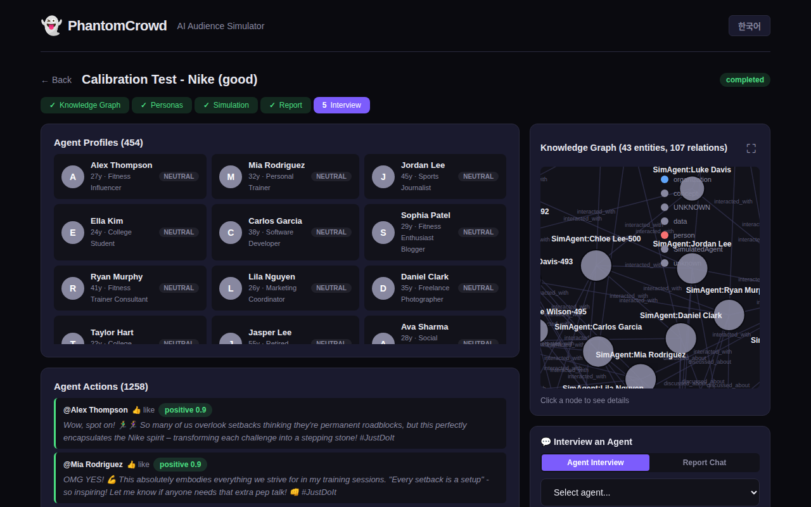
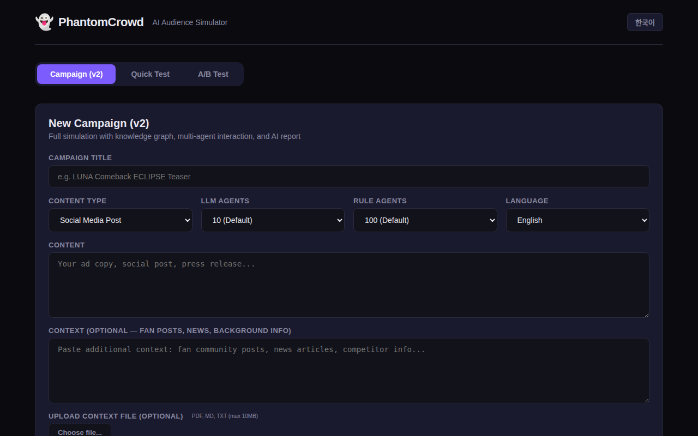
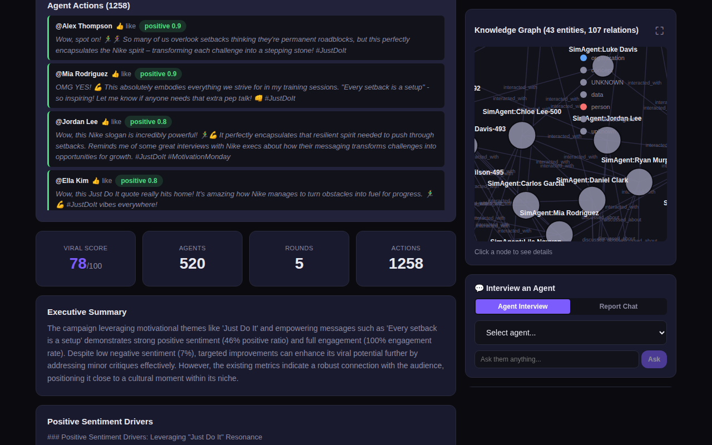
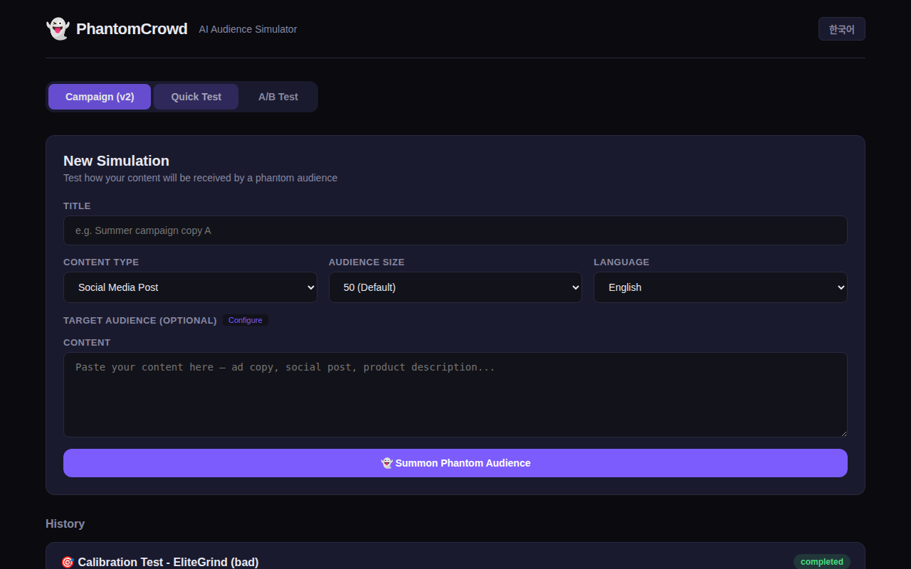
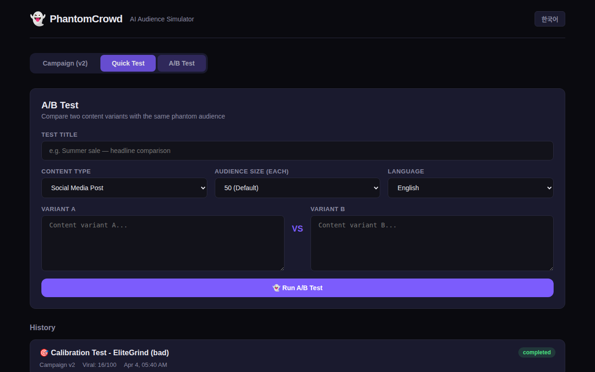

<p align="center">
  <h1 align="center">👻 PhantomCrowd</h1>
  <p align="center"><strong>Marketing AI Chief of Staff</strong></p>
  <p align="center">Multi-agent social simulation with knowledge graphs. Preview how your content spreads before you publish.</p>
</p>

<p align="center">
  
  
  
  
  
  
</p>

---

<p align="center">
  
</p>

---

## What is PhantomCrowd?

PhantomCrowd is a **multi-agent AI simulation platform** for marketing teams. It builds a knowledge graph from your content and context, spawns hundreds of AI personas that interact with each other on a simulated social network, and produces an actionable marketing report with viral predictions.

> Type your K-POP comeback teaser + fan community context. PhantomCrowd builds a knowledge graph, spawns up to 100 LLM-powered agents + 2,000 rule-based agents that argue, share, and react on simulated Twitter. Watch the content spread (or die). Get a report: "Viral Score 82/100. 18-24 segment drove 70% of shares. Recommendation: add a dance challenge hook."

**Not a survey. A simulation.**

## Features

### v2: Campaign Mode (Multi-Agent Simulation)

- **Knowledge Graph** (LightRAG) -- auto-extract entities and relationships from your content + context
- **Multi-Agent Interaction** (camel-ai) -- LLM agents post, reply, share, like, argue with each other
- **Tiered Agent Model** -- up to 100 full-LLM agents + up to 2,000 rule-based agents for realistic crowd dynamics
- **5-Stage Pipeline** -- Graph Build -> Persona Generation -> Simulation -> Report -> Interview
- **ReportAgent** -- auto-generated marketing report with viral score, segment analysis, key insights, recommendations
- **Agent Interview** -- ask specific agents "why did you share this?" post-simulation
- **D3.js Knowledge Graph** -- interactive force-directed graph visualization
- **Real-Time Action Feed** -- watch agents interact live during simulation

### v1: Quick Test Mode

- **Single Simulation** -- fast persona reactions (10-500 personas)
- **A/B Testing** -- compare two content variants head-to-head
- **Custom Target Audience** -- age, gender, occupation, interests filtering
- **Multi-Language** -- simulate audience reactions in 12 languages (Korean, Japanese, Chinese, Spanish, French, etc.)
- **Export** -- CSV / JSON download
- **History Comparison** -- compare past simulations side-by-side

## Screenshots

### Campaign Mode (v2) -- Knowledge Graph + Multi-Agent Simulation
<p align="center">
  
  <br><em>Create a campaign with content + context data</em>
</p>

<p align="center">
  
  <br><em>Knowledge graph visualization (D3.js) + real-time agent action feed</em>
</p>

<p align="center">
  
  <br><em>Viral Score (calibrated 0-100), agent count, report with segment analysis</em>
</p>

<p align="center">
  
  <br><em>Full report, actionable recommendations, and post-sim agent interview panel</em>
</p>

### Quick Test + A/B Test (v1)
<p align="center">
  &nbsp;
  
  <br><em>Quick single simulation (left) and A/B variant comparison (right)</em>
</p>

## Architecture

```
PhantomCrowd v2
==============================================================================

  YOUR CONTENT              CONTEXT DATA              AUDIENCE CONFIG
  (ad copy, social post)    (fan posts, news)         (age, interests)
         |                        |                         |
         v                        v                         v
  +-----------------------------------------------------------------+
  |                    Layer 1: Data Ingestion                       |
  +-----------------------------------------------------------------+
                               |
                               v
  +-----------------------------------------------------------------+
  |              Layer 2: Knowledge Graph (LightRAG)                 |
  |                                                                  |
  |   Entity Extraction -> Relationship Mapping -> Community Detection|
  |   [LUNA] --debuted_under--> [Star Entertainment]                 |
  |   [LUNA] --rival_of--> [NOVA] --signed_with--> [SM Ent.]        |
  |   [Moonlight] --fanbase_of--> [LUNA]                             |
  |                                                                  |
  |   Storage: NetworkX | Embedding: nomic-embed-text (Ollama)       |
  +-----------------------------------------------------------------+
                               |
                               v
  +-----------------------------------------------------------------+
  |          Layer 3: Multi-Agent Simulation (camel-ai)              |
  |                                                                  |
  |   Up to 100 LLM Agents (full personality, graph-grounded context) |
  |   + Up to 2,000 Rule-Based Agents (probability-driven behavior)  |
  |                                                                  |
  |   Round 1: @Yuna_fan posts "OMG ECLIPSE!!" -> 3 replies, 5 likes|
  |   Round 2: @Music_critic posts "Bold move..." -> debate starts   |
  |   Round 3: @Casual_viewer shares -> viral chain begins           |
  |                                                                  |
  |   Actions: post, reply, share, like, dislike                     |
  +-----------------------------------------------------------------+
                               |
                               v
  +-----------------------------------------------------------------+
  |            Layer 4: Report Agent (ReACT pattern)                 |
  |                                                                  |
  |   Tools: graph_search, action_search, sentiment_aggregate        |
  |                                                                  |
  |   Output:                                                        |
  |   - Viral Score: 82/100                                          |
  |   - Executive Summary                                            |
  |   - Audience Reception / Viral Potential / Segment Analysis       |
  |   - Key Insights / Recommendations                               |
  +-----------------------------------------------------------------+
                               |
                               v
  +-----------------------------------------------------------------+
  |              Layer 5: Marketing Dashboard (Vue 3)                |
  |                                                                  |
  |   Campaign Wizard -> Graph Viz -> Live Feed -> Report -> Interview|
  |   D3.js Force Graph | ECharts | Agent Interview Panel            |
  +-----------------------------------------------------------------+

  Infrastructure: FastAPI | SQLite | Ollama (fully local, no paid API)
```

## Quick Start

### Prerequisites
- Python 3.12+
- Node.js 20+
- [Ollama](https://ollama.com/) (recommended, free local LLM)

### 1. Install Ollama + Models

```bash
curl -fsSL https://ollama.com/install.sh | sh
ollama pull qwen2.5:7b
ollama pull nomic-embed-text
```

### 2. Clone & Setup

```bash
git clone https://github.com/l2dnjsrud/PhantomCrowd.git
cd PhantomCrowd

# Backend
cd backend
python3 -m venv .venv
source .venv/bin/activate
pip install -r requirements.txt
cp .env.example .env
# Edit .env (defaults work with Ollama)

# Frontend
cd ../frontend
npm install
```

### 3. Run

```bash
# Terminal 1: Backend
cd backend && source .venv/bin/activate
uvicorn app.main:app --reload

# Terminal 2: Frontend
cd frontend
npm run dev
```

Open **http://localhost:5173**

### Docker

```bash
docker compose up --build
```

Open **http://localhost:8000**

## API

### v2: Campaign (Multi-Agent Simulation)

| Method | Endpoint | Description |
|--------|----------|-------------|
| POST | `/api/v2/campaigns/` | Create campaign + start full pipeline |
| GET | `/api/v2/campaigns/` | List all campaigns |
| GET | `/api/v2/campaigns/{id}` | Get campaign with report |
| GET | `/api/v2/campaigns/{id}/graph` | Knowledge graph (nodes + edges) |
| GET | `/api/v2/campaigns/{id}/simulation/status` | Simulation progress |
| GET | `/api/v2/campaigns/{id}/actions` | Agent actions feed |
| GET | `/api/v2/campaigns/{id}/report` | Full marketing report |
| POST | `/api/v2/campaigns/{id}/interview` | Interview a specific agent |

### v1: Quick Test

| Method | Endpoint | Description |
|--------|----------|-------------|
| POST | `/api/simulations/` | Quick persona simulation |
| POST | `/api/ab-tests/` | A/B test comparison |
| GET | `/api/export/simulations/{id}/csv` | Export as CSV |
| GET | `/api/export/simulations/{id}/json` | Export as JSON |

## Supported LLM Providers

Works with **any OpenAI-compatible API**:

| Provider | Base URL | Models | Cost |
|----------|----------|--------|------|
| **Ollama** (recommended) | `http://localhost:11434/v1` | qwen2.5:7b, llama3.1 | Free |
| **OpenAI** | `https://api.openai.com/v1` | gpt-4o-mini, gpt-4o | Paid |
| **Groq** | `https://api.groq.com/openai/v1` | llama-3.1-8b-instant | Free tier |
| **Together AI** | `https://api.together.xyz/v1` | meta-llama/Llama-3.1-8B | Free tier |

## Tech Stack

| Layer | Technology |
|-------|-----------|
| **Knowledge Graph** | LightRAG + NetworkX + nomic-embed-text |
| **Multi-Agent** | camel-ai (ChatAgent) |
| **Backend** | Python, FastAPI, SQLAlchemy, SQLite |
| **Frontend** | Vue 3, Vite, D3.js, ECharts |
| **LLM** | Any OpenAI-compatible (Ollama default) |
| **Deploy** | Docker |

## Configuration

Environment variables (prefix `PC_`):

| Variable | Default | Description |
|----------|---------|-------------|
| `PC_LLM_API_KEY` | `ollama` | LLM API key |
| `PC_LLM_BASE_URL` | `http://localhost:11434/v1` | LLM API base URL |
| `PC_LLM_MODEL` | `qwen2.5:7b` | Model for agent reactions |
| `PC_LLM_ANALYSIS_MODEL` | `qwen2.5:7b` | Model for analysis/reports |
| `PC_DEBUG` | `false` | Enable debug logging |

## Comparison with MiroFish

| Feature | PhantomCrowd | MiroFish |
|---------|-------------|----------|
| Knowledge Graph | LightRAG (free, local) | Zep Cloud (paid SaaS) |
| Agent Interaction | camel-ai (Python 3.12+) | OASIS (Python <3.12 only) |
| Marketing UX | A/B test, targeting, export | General-purpose |
| Local Execution | Ollama, fully free | Requires paid API |
| Report | Auto-generated marketing report | ReportAgent |
| Agent Interview | Post-sim Q&A | Post-sim Q&A |
| License | MIT | AGPL-3.0 |

## Roadmap

- [x] Multi-agent interaction simulation
- [x] LightRAG knowledge graph integration
- [x] ReportAgent with marketing analysis
- [x] Agent interview system
- [x] A/B testing
- [x] Multi-language simulation (12 languages via LLM instruction)
- [x] Export (CSV/JSON)
- [x] D3.js knowledge graph visualization
- [ ] WebSocket real-time streaming
- [ ] Image/video content analysis
- [ ] URL scraping for context ingestion
- [ ] PDF upload for context
- [ ] Neo4j backend for large-scale graphs
- [ ] Team collaboration features
- [ ] Webhook notifications (Slack, Discord)

## Contributing

Contributions welcome! Please open an issue first to discuss what you'd like to change.

## License

[MIT](LICENSE)

---

<p align="center">
  <strong>👻 Stop guessing. Start simulating.</strong><br>
  <sub>Multi-agent marketing simulation powered by LightRAG + camel-ai + Ollama</sub>
</p>
